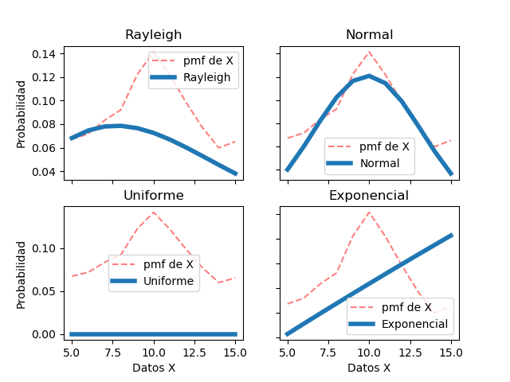
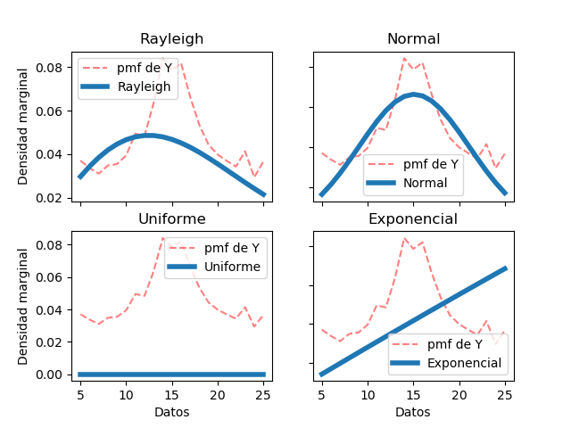
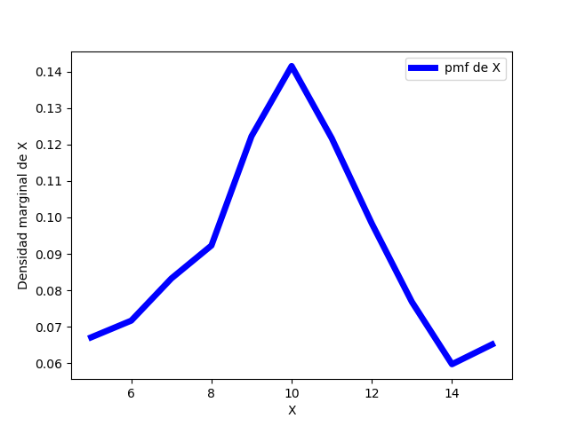
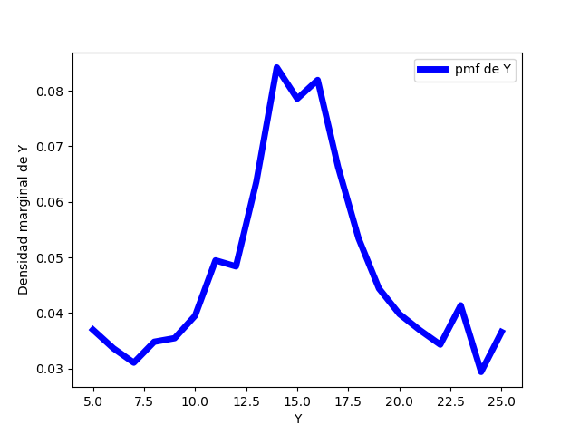
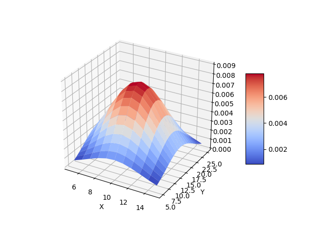

# Tarea 3: Variables aleatorias múltiples

## Autor
```
Jorge Muñoz Taylor 
A53863
jorge.munoztaylor@ucr.ac.cr
```

## Como ejecutar el código
```
>>python3 tarea3 xy.csv
```

En el archivo xy.csv está el registro de la frecuencia relativa de dos variables aleatorias conjuntas en forma de tabla. También está el archivo xyp.csv donde vienen todos los pares (x, y) y su probabilidad asociada sin embargo el código se creó en base al archivo xy.csv.


## Bibliotecas necesarias

```
* numpy
* Matplotlib
* Scipy
* math
```

## Solución


#### 1. A partir de los datos, encontrar la mejor curva de ajuste (modelo probabilístico) para las funciones de densidad marginales de X y Y.

A partir de los datos, analíticamente se puede observar que la curva que mejor se ajusta a los datos (tanto para X como para Y) es la correspondiente a la función de densidad Normal (Gaussiana), note de las gráficas como el modelo tiene prácticamente el mismo recorrido de los datos -tome en cuenta que los datos presentan ruido-. En el código se mostrarán los valores de la media y la desviación estándar del modelo normal para X e Y.




---
#### 2. Asumir independencia de X y Y. Analíticamente, ¿cuál es entonces la expresión de la función de densidad conjunta que modela los datos?

 Como asumimos que X e Y son independientes entonces la función de densidad conjunta 
 

 

 

 
\frac{1}{2}
 $$
 
 fX,Y(x,y) = fX(x) * fY(y)

---
#### 3. Hallar los valores de correlación, covarianza y coeficiente de correlación (Pearson) para los datos y explicar su significado.


---
#### 4. Graficar las funciones de densidad marginales (2D), la función de densidad conjunta (3D).



