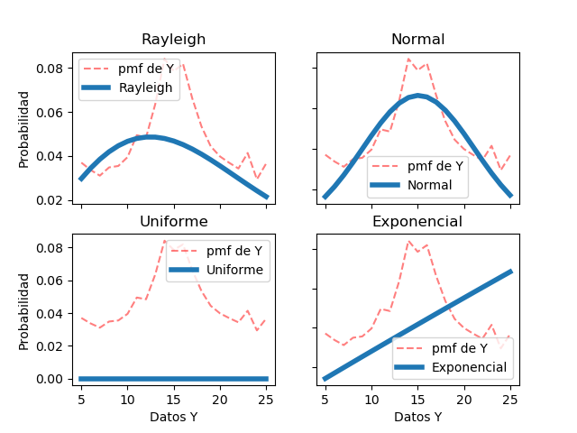

# Tarea 3: Variables aleatorias múltiples

## Autor
```
Jorge Muñoz Taylor 
A53863
jorge.munoztaylor@ucr.ac.cr
```

## Como ejecutar el código
```
>>python3 tarea3 xy.csv
```

En el archivo xy.csv está el registro de la frecuencia relativa de dos variables aleatorias conjuntas en forma de tabla. También está el archivo xyp.csv donde vienen todos los pares (x, y) y su probabilidad asociada sin embargo el código se creó en base al archivo xy.csv.


## Bibliotecas necesarias

```
* numpy
* Matplotlib
* Scipy
* math
```

## Solución


#### 1. A partir de los datos, encontrar la mejor curva de ajuste (modelo probabilístico) para las funciones de densidad marginales de *X* y *Y*.

Analíticamente se puede observar que la curva que mejor se ajusta a los datos (tanto para *X* como para *Y*) es la correspondiente a la función de densidad **Normal (o Gaussiana)**, note en las gráficas como el modelo tiene prácticamente el mismo recorrido de los datos -tome en cuenta que los datos presentan ruido-. En el código se muestran los valores de la media y la desviación estándar del modelo encontrado para *X* e *Y*.

- Mosaico con 4 modelos de distribución ajustados a *X*.


- Mosaico con 4 modelos de distribución ajustados a *Y*.


---
#### 2. Asumir independencia de *X* y *Y*. Analíticamente, ¿cuál es entonces la expresión de la función de densidad conjunta que modela los datos?

 Como asumimos que *X* e *Y* son variables aleatorias independientes, la función de densidad conjunta es igual a la multiplicación de las funciones de densidad de los modelos encontrados para *X* e *Y*. En este caso para los datos dados el modelo que mejor se ajustaba a *X* e *Y* era el modelo de distribución normal. Por lo tanto: 
 

 

 

 Finalmente la expresión de la función de densidad conjunta es:

 

 


---
#### 3. Hallar los valores de correlación, covarianza y coeficiente de correlación (Pearson) para los datos y explicar su significado.

Los valores se encontraron por medio de código (ver archivo *python3* adjunto), del que se obtuvieron los siguientes valores:

- Correlación: 149.5428

Este valor indica que existe una alta dispersión entre los datos analizados, es decir, que hay muy poca relación lineal entre ellos, esto nos ayuda a entender que *X* e *Y* son variables aleatorias con poca relación entre ellas -recuerde que entre más cercano a 0 sea la correlación, más relacionadas estarán las variables aleatorias-. 


- Covarianza: 0.0667

El valor de covarianza es cercano a 0, por lo que se puede concluir que las variables aleatorias usadas son prácticamente independientes. Esto se puede entender fácilmente con la fórmula de la covarianza, donde al valor de correlación de los datos se le resta el valor esperado de *X* por el valor esperado de *Y*, ya que si la correlación es igual a *E[X]* *E[Y]* entonces *X* e *Y* serían independientes y por lo tanto la covarianza tendría un valor de 0, como es el caso que nos ocupa.


- Coeficiente de correlación (Pearson): 0.003354 

El coeficiente de Pearson mide la dependencia lineal entre dos variables aleatorias, entre más cercano a 0 sea el coeficiente menos relación lineal existirá entre las variables aleatorias -si es 1 significa que la relación entre las variables es totalmente lineal-. En nuestro caso ocurre que el coeficiente de Pearson es prácticamente 0, resultado que se ajusta claramente a los valores obtenidos para la covarianza y la correlación, ya que al no haber dependencia entre las variables aleatorias es esperable que los datos estén dispersos sin seguir una relación lineal.

---
#### 4. Graficar las funciones de densidad marginales (2D), la función de densidad conjunta (3D).

- Modelo de mejor ajuste de *X*.


- Modelo de mejor ajuste de *Y*.


- Densidad conjunta de las variables aleatorias *X* e *Y*
